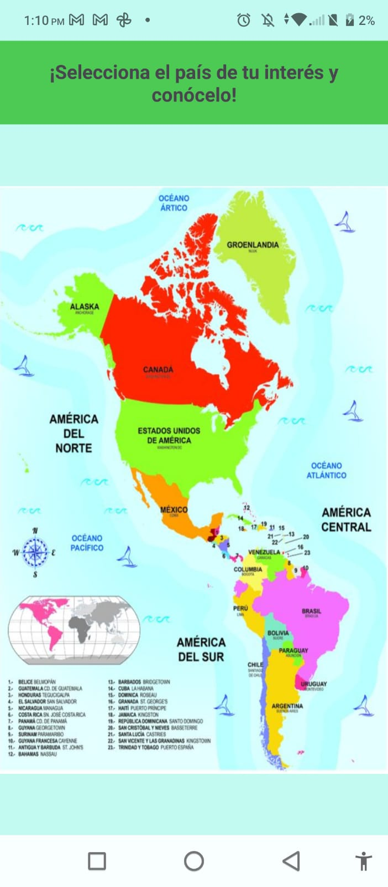
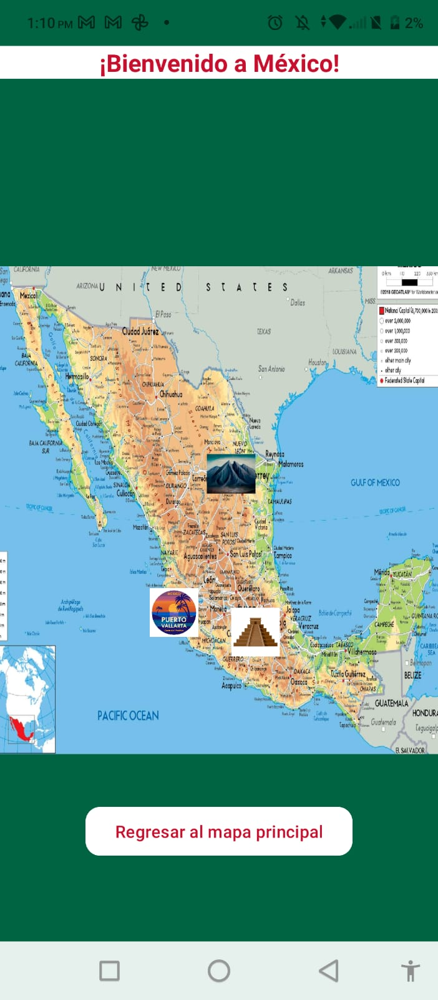
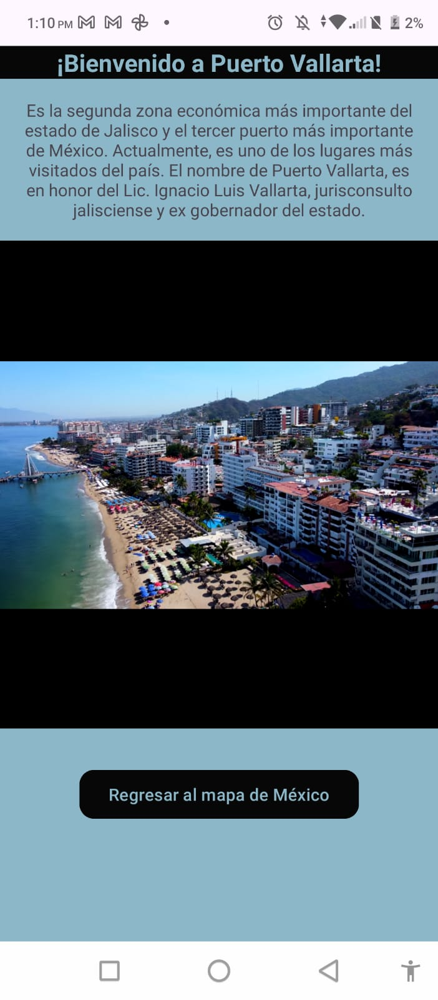
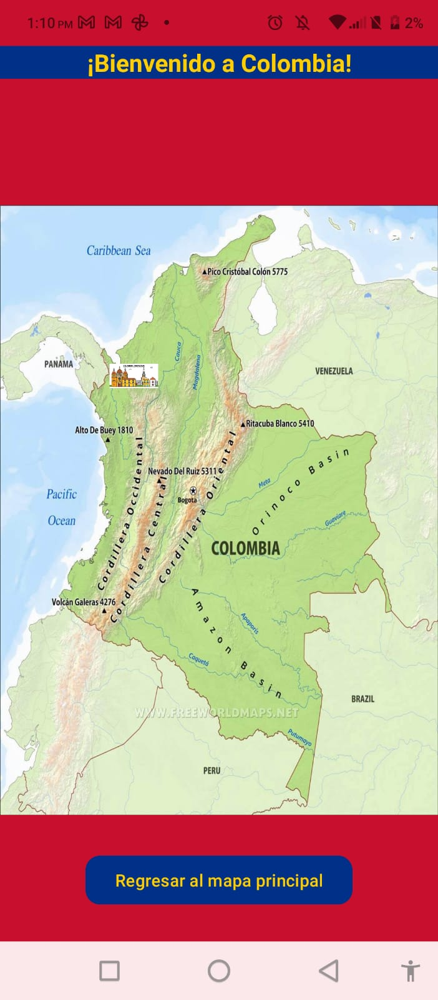
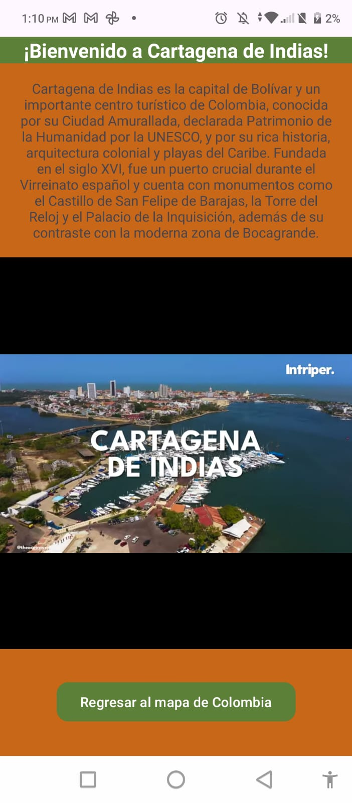

<h1 align="center">Práctica 2: Aplicación Móvil Básica</h1>

---

## Insignias

---

## Índice
- [Título](#tarea-2--diseño-de-una-aventura-interactiva)
- [Insignias](#insignias)
- [Índice](#índice)
- [Objetivo](#objetivo)
- [Descripción del proyecto](#descripción-del-proyecto)
- [Ejemplo de Uso](#ejemplo-de-uso)
- [Presentación de la aplicación](#presentación-de-la-aplicación)
- [Estado de la tarea](#estado-de-la-tarea)
- [Características de la aplicación](#características-de-la-aplicación)
- [Acceso al proyecto](#acceso-al-proyecto)
- [Tecnologías utilizadas](#tecnologías-utilizadas)
- [Desarrollador](#-desarrollador)

---

## Objetivo

El propósito de esta tarea es que ustedes desarrollen una aplicación Android que demuestre una navegación de usuario inmersiva y temática, y que integre elementos de interfaz creativos.

---

## Descripción del proyecto

Esta aplicación de Android contiene un Activity principal en el que se muestran los diferentes países de América. En dicha pantalla se encuentran una serie de botones sobre algunos de los países, que al ser seleccionados nos llevarán a otro activity, el cuál contendrá un mapa de mayor tamaño del país. Los países disponibles se listan a continuación:

<ul>
  <li>Alaska</li>
  <li>Groenlandia</li>
  <li>Canadá</li>
  <li>Estados Unidos de América</li>
  <li>México</li>
  <li>Venezuela</li>
  <li>Colombia</li>
  <li>Perú</li>
  <li>Brasil</li>
  <li>Argentina</li>
  
</ul>

  

Cada uno de los países tiene un activity, en el que se muestran por lo menos 1 de los lugares turísticos más emblemáticos del país. Cada uno de esos lugares tiene una imagen represenatativa, la cual funciona como un botón, que al darle click me envía a otro activity, en el que se mostrará un pequeño resúmen del lugar y un video representativo. En este activity tenemos la opción de regresar al mapa de América con el botón que se encuentra en la parte inferior del activity.

  

Una vez que se le dio click en la imagen de lugar turístico que se desea conocer, se abre un activity en el que se carga el fragment correspondiente al lugar. En este fragment se muestra el título en la parte superior, seguido de una descripción breve y un video representativo. Al final tenemos un botón que nos permite regresar al mapa del país en el que visitamos el lugar para poder seguir observando otros lugares.  

  

---
## Ejemplo de Uso
<table>
  <tr>
    <th>Elección del país a visitar</th>
    <th>Elección del lugar visitar</th>
    <th>Resúmen del lugar</th>
  </tr>
  <tr>
    <th>
      
    </th>
    <th>
      
    </th>
    <th>
      
    </th>
  </tr>
</table>

---

## Presentación de la aplicación 
https://github.com/user-attachments/assets/77734344-893d-4594-b24c-dd554714be43

---

## Estado de la tarea
- ✅ Tarea finalizada

---

## Características de la aplicación 
- [x] Pantalla de inicio
- [x] Uso de Activities
- [x] Uso de Fragments
- [x] Los botones de la pantalla de inicio me dirigen a otro Activity
- [x] Cada país tiene un Activity diferente
- [x] Los botones de cada país me dirigen a otro Activity
- [x] En le Activity del lugar turístico se carga el Fragment correspondiente   

---

## Acceso al proyecto

Comando para clonar repositorio:

git clone https://github.com/Alfx17/Aventura_Interactiva.git

---

## Tecnologías utilizadas
- Kotlin
- Android Studio

---

## Desarrollador
